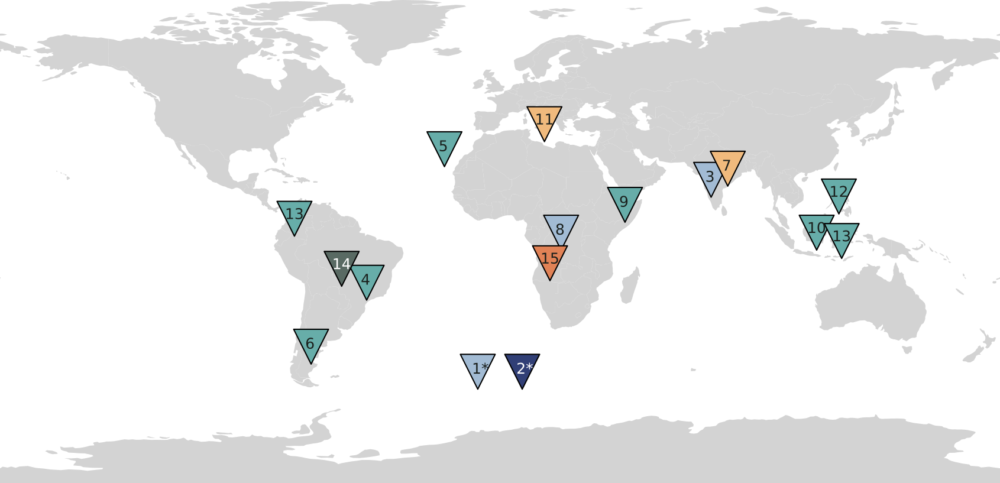

# Impact Scholars 2023

We are thrilled to introduce 15 teams of 74 Impact Scholars as part of our 2023 cohort! 

Their ambitious projects focus on pressing climate issues on local and global scales, as well as their societal impact.

<figure>
    
    <figcaption><i>A representation of the scholar projects' geographical regions of focus. The two projects marked by an asterisk (*) investigate phenomena on a global scale.</i></figcaption>
</figure>

1.

**Analyzing Global Wind Potential for the Next 50 Years and its socio-economic impact**

Team "Brachiosaurus_Bharatanatyam_Leggiero"

Pallaw Mishra, Shashank Kumar Roy, Wil Laura

---

2.

**Comparing Sea Level Height Measurements from Tidal Gauges and ECCO Model in Extreme Weather Events**

Team "Rajasaurus Baris"

Franck Porteous, Faith Hunja, Hannah Krohn, C. Gabriela Mayorga-Adame, Ayman Said

---

3.

**Assessing Spatio-Temporal Precipitation Variability and Extreme Events in India**

Team "Monsoon Blues"

Stefy Thomas, Sattiki Ganguly, Jeciliya Selva Kiruba S, Khushi Dani, Dr. P P Choudhari, Sintayehu Fetene Demessie

---

4.

**Deepening into the rainy impact of El Niño events over South of Brazil precipitation**

Team "Staccato"

Douglas Medeiros Nehme, Gabriel Henrique da Silva Soares, Lívia Sancho

---

5.

**ENSO's Influence on the Coastal Upwelling along Northwest Africa through the Pacific-North Atlantic Teleconnection**

Team "Fukuivenator Rhumba"

Sthitapragya Ray, Danny McCulloch, Andrea A. Cabrera, Diana Marcela Guzmán Lugo, Elizaveta Baranova-Parfenova, Vanni Consumi, Daria Proklova

---

6.

**Fire Risk Assessment of the Andean-Patagonian Forest**

Team "Tyrannosaurus Tango Dolce"

Cristian Farfan, Ricardo Rengifo, Raphael Rocha, Luciana Rojas, Franco Barrionuevo

---

7.

**Proposal for heatwave in Asia(India)**

Team "Tarantino"

Ahmad Rashiq, Seyed Mehdi Mirbazel, Arihant Jain

---

8.

**Impact of Deforestation and Multi-year Cyclical Processes on Precipitation Patterns and Cereal Production in Congo River Basin**

Team "Fortepiano, Hesperosaurus_bon"

James Hartzell, Magda Altman, Pratik Bhandari, Lorenzo Pierini, Masoumeh Bahri, Rajiv Kumar Srivastava, Jeffrey N.A. Ayree

---

9.

**Predicting future impacts of ENSO on NDVI in the Greater Horn of Africa**

Team "Saurophaganax_Popping_forte"

Ximena Miranda, Sergei Nabatov, Abdus Samad, Jesús Pozo T., Alethia Kielbasa, Benedetta Francesconi

---

10.

**Projected Influences of Interannual Climate Variability on Summer Monsoon Onset and Extreme Weather Events in the Indonesia-North Australia Monsoon Region**

Team "Fortepiano"

Zhixian Yang, René Gabriel Navarro Labastida, Selyn Rousse Acuña Cama, Tejaswini M. Pawase, Rosmery Lidez Condori Huanca, Naomi Nafisa Rahman

---

11.

**The Past and Future of Mediterranean Heat Waves**

Team "Andante"

Lana Flanjak, Natalia Gabdrakhmanova, Timon Kunze, Farukcan Sağlam

---

12.

**Understand underlying mechanisms of ENSO and predicting its impact on the countries surrounding the Niño Region.**

Team "Iguanacolossus_bogel Agitato"

Kirtana Sunil Phatnani, Kimia Marvi, Anjana Shree, Neil Marc Sordilla, Eligio Maure, Danny McCulloch

---

13.

**Understanding historical and future impacts of El Niño on climate and food production in Colombia and Indonesia**

Team "Protoceratops_Jitterbug_Vivace"

Ninibeth Sarmiento Herrera, Elisa Passos, Lakhvinder Kaur

---

14.

**Understanding the interactions of socio-economic policy, land use change, climate and carbon sequestration within the biomes of Mato Grosso: Integrating Land Cover, Precipitation, Temperature, GPP and Economic Factors**

Team "Beipiaosaurus moonwalk"

Sofia Corradi, Daniela Velásquez, Magnolia Song, Maryann Alata Chambilla, Manojna Polisetty

---

15.

**Wildfires in Angola: Burn Areas and Vegetation Index**

Team "Jintasaurus Skip Energico"

Agnessa Karapetian, Ana Carolina Temporao Marques Filipe, Kamil Vlcek, Sedem Buabassah, Hatice Busra Gokbunar, Xintong Huang

