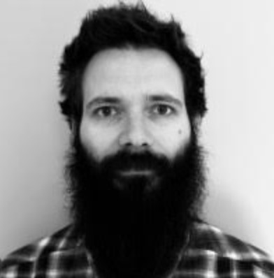

# Clean and Reproducible Code Workshop

## Overview

Writing intelligeable and reproducible code is critical for ensuring accuracy, collaboration, and longevity of projects. Additionally, clean and well-maintained code ensures that work can be trusted, extended, and validated. This workshop will introduce scholars to essential coding practices, including code formatting and testing, with a focus on research applications. Attendees will also learn how to implement continuous integration (CI) to automate code validation, ensuring reliable, reproducible results.

## Speaker Bio

**Dr. Peer Herholz**
*Research Assistant Professor at Northwestern University*

Peer Herholz is a Research Assistant Professor at Northwestern University, working at the intersection of NeuroAI, data science and open & reproducible science. Besides his research in generalization, representations for adaptive behavior and auditory processing, he is working on a multitude of open-access research software and is part of many initiatives concerned with open and reproducible science.